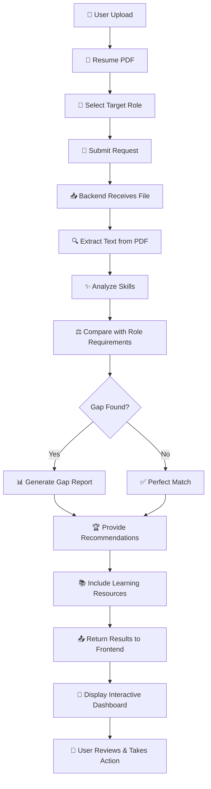
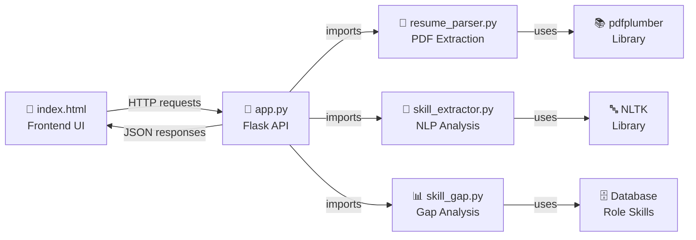

# 🚀 AI Resume Analyzer - System Workflow & Architecture

> **Complete visualization of the AI Resume Analyzer system architecture, data flow, and component interactions**

---

## 📊 1. Complete System Flowchart



---

## 🏗️ 2. System Architecture

### Frontend
**Technology:** HTML5 | CSS (Tailwind) | JavaScript

- ✓ HTML/CSS/JavaScript UI
- ✓ Tailwind CSS Styling
- ✓ Dark Mode Support
- ✓ Drag & Drop Upload
- ✓ Interactive Dashboard

**File:** `Frontend/index.html`

### Backend API
**Technology:** Python | Flask | CORS

- ✓ Flask Framework
- ✓ CORS Enabled
- ✓ File Handling
- ✓ JSON Responses
- ✓ Error Handling

**File:** `Backend/app.py`

### AI Processing
**Technology:** Python | NLP | Pattern Matching

- ✓ PDF Text Extraction
- ✓ Skill Recognition
- ✓ Gap Analysis
- ✓ Recommendations
- ✓ Resource Mapping

**Files:** `Backend/resume_parser.py` | `Backend/skill_extractor.py` | `Backend/skill_gap.py`

---

## 🔄 3. Step-by-Step Data Flow

### Step 1️⃣ Resume Upload
**User uploads PDF resume and selects target career role**

User selects from roles like: Backend, Frontend, Data Science, DevOps, etc.

```
POST /analyze
Content-Type: multipart/form-data

Parameters:
- resume: [PDF FILE]
- role: "backend"
- include_resources: true
```

---

### Step 2️⃣ PDF Parsing
**`resume_parser.py`** extracts raw text from PDF pages using pdfplumber library

- Extract text from all PDF pages
- Clean text (remove extra spaces, normalize newlines)
- Return cleaned resume text in lowercase

```python
def extract_text_from_resume(file: FileStorage) -> Optional[str]:
    """Extract and clean text from uploaded PDF resume"""
    # Uses pdfplumber to parse PDF
    # Cleans and normalizes text
    # Returns cleaned text
```

---

### Step 3️⃣ Skill Extraction
**`skill_extractor.py`** identifies all technical skills from resume text

- Search for programming languages (Python, Java, JavaScript, etc.)
- Find frameworks and tools (React, Django, Express, etc.)
- Identify databases and platforms (PostgreSQL, MongoDB, AWS, etc.)
- Assign skill proficiency levels (Beginner, Intermediate, Expert)

**Extracted Skills Example:**
```
Languages: python, javascript, java
Frameworks: react, django, express
Databases: postgresql, mongodb
Tools: docker, git, aws
```

---

### Step 4️⃣ Gap Analysis
**`skill_gap.py`** compares user's skills with role requirements

- Load role-specific skill requirements
- Compare against extracted skills
- Identify missing skills
- Categorize by priority:
  - 🔴 **Critical** - Must-have skills
  - 🟠 **High** - Strongly recommended
  - 🟡 **Medium** - Nice to have

```python
# Example gap analysis result
missing_skills = {
    "critical": ["Docker", "Kubernetes"],
    "high": ["React", "TypeScript"],
    "medium": ["Jest", "GraphQL"]
}
skill_gap_percentage = 35
```

---

### Step 5️⃣ Generate Recommendations
**Create actionable recommendations and learning roadmap**

- Prioritize skills to learn (based on role requirements)
- Suggest learning resources (courses, tutorials, documentation)
- Provide career feedback and insights
- Include estimated timelines for skill acquisition

```json
{
  "recommendations": [
    {
      "skill": "Docker",
      "priority": "critical",
      "reason": "Essential for backend development",
      "resources": [
        {
          "name": "Docker Official Documentation",
          "type": "docs",
          "url": "https://docs.docker.com"
        },
        {
          "name": "Docker & Kubernetes Complete Guide",
          "type": "course",
          "url": "https://udemy.com/..."
        }
      ],
      "estimated_hours": 40
    }
  ]
}
```

---

### Step 6️⃣ Display Results
**Frontend renders interactive dashboard with analysis results**

- Show matched skills with visual indicators
- Display skill gaps in priority order
- Visualize learning roadmap with timelines
- Provide downloadable resources and recommendations

---

## 🧩 4. Component Relationships



---

## 🔌 5. API Endpoints

### GET `/` - Health Check
**Verify API is running**

```bash
curl http://localhost:5000/
```

**Response:**
```json
{
  "status": "OK",
  "message": "AI Resume Analyzer API is running"
}
```

---

### POST `/analyze` - Analyze Resume
**Upload resume and get skill gap analysis**

**Request:**
```bash
curl -X POST http://localhost:5000/analyze \
  -F "resume=@your_resume.pdf" \
  -F "role=backend" \
  -F "include_resources=true"
```

**Form Parameters:**
- `resume` (file, required) - PDF resume file
- `role` (string, required) - Target job role
- `include_resources` (boolean, optional) - Include learning resources

---

## 📋 6. Sample API Response

```json
{
  "status": "success",
  "role": "backend",
  "matched_skills": [
    {
      "skill": "python",
      "category": "language",
      "proficiency": "expert"
    },
    {
      "skill": "sql",
      "category": "database",
      "proficiency": "intermediate"
    }
  ],
  "missing_skills": {
    "critical": [
      "Docker",
      "Kubernetes"
    ],
    "high": [
      "React",
      "TypeScript"
    ],
    "medium": [
      "Jest",
      "GraphQL"
    ]
  },
  "skill_gap_percentage": 35,
  "recommendations": [
    {
      "skill": "Docker",
      "priority": "critical",
      "reason": "Essential container technology for modern backend development",
      "resources": [
        {
          "name": "Docker Official Documentation",
          "type": "docs",
          "url": "https://docs.docker.com"
        }
      ],
      "estimated_hours": 40
    }
  ],
  "overall_match": "Good Fit!",
  "match_percentage": 65,
  "career_feedback": "You have a solid foundation in backend development. Focus on containerization and orchestration tools to become a DevOps-ready backend engineer."
}
```

---

## 🛠️ 7. Technology Stack

### Frontend
- **HTML5** - Semantic markup
- **Tailwind CSS** - Utility-first styling
- **JavaScript (Vanilla)** - Interactivity & DOM manipulation
- **Lucide Icons** - Beautiful UI icons

### Backend
- **Python 3.x** - Core programming language
- **Flask** - Lightweight web framework
- **Flask-CORS** - Cross-origin resource sharing
- **pdfplumber** - PDF parsing and text extraction
- **werkzeug** - Secure file handling

### Processing & Analysis
- **NLTK** - Natural Language Toolkit for NLP tasks
- **Regex** - Pattern matching for skill detection
- **Collections** - Data structures for processing
- **JSON** - Structured data format

---

## ✨ 8. Key Features

### ⚡ Instant Analysis
Upload your resume and get real-time skill gap analysis with AI-powered insights. No waiting, immediate results.

### 🎯 Role-Specific Comparison
Compare your skills against specific job titles including:
- Backend Developer
- Frontend Developer
- Full Stack Developer
- Data Scientist
- DevOps Engineer

### 📚 Learning Resources
Get curated learning resources for each missing skill:
- Online courses (Udemy, Coursera, etc.)
- Official documentation
- Tutorial articles
- YouTube channels

### 📊 Prioritized Skills
Skills ranked by importance for efficient learning:
- 🔴 **Critical** - Must-have for the role
- 🟠 **High** - Strongly recommended
- 🟡 **Medium** - Nice to have
- 🟢 **Basic** - Foundational knowledge

### 🎨 Interactive Dashboard
- Visual skill comparison charts
- Progress tracking
- Personalized roadmap
- Dark mode support

### 📈 Career Insights
- Overall match percentage
- Career feedback and guidance
- Alternative role suggestions
- Professional recommendations

---

## 🚀 Getting Started

### Prerequisites
```bash
Python 3.8+
pip
Modern web browser
```

### Installation

1. **Clone the repository**
```bash
git clone <repository-url>
cd "AI Resume Analyzer & Skill Gap Finder"
```

2. **Install Python dependencies**
```bash
pip install flask flask-cors pdfplumber nltk
```

3. **Run the Flask backend**
```bash
cd Backend
python app.py
```

4. **Open the frontend**
```bash
# Open Frontend/index.html in your browser
```

---

## 📁 Project Structure

```
AI Resume Analyzer & Skill Gap Finder/
├── Backend/
│   ├── app.py                  # Main Flask application
│   ├── resume_parser.py        # PDF text extraction
│   ├── skill_extractor.py      # Skill recognition & extraction
│   ├── skill_gap.py            # Gap analysis & recommendations
│   └── __pycache__/            # Python cache
├── Frontend/
│   ├── index.html              # Main UI interface
│   └── backup.html             # Backup UI version
├── WORKFLOW_VISUALIZATION.md   # System documentation (this file)
└── README.md                   # Project README
```

---

## 🔐 Error Handling

The system includes comprehensive error handling:

- ✓ Missing resume file validation
- ✓ Invalid PDF file detection
- ✓ Empty role selection prevention
- ✓ Text extraction failure recovery
- ✓ Skill analysis validation
- ✓ Graceful error messages to users

---

## 🎓 Learning Outcomes

After using this tool, users will:

1. **Understand** their current skill level vs. role requirements
2. **Identify** specific gaps in their technical knowledge
3. **Prioritize** which skills to learn based on job requirements
4. **Discover** quality learning resources for skill development
5. **Get** personalized career guidance and recommendations
6. **Plan** an effective skill acquisition roadmap

---

## 📊 Example Use Cases

### Case 1: Career Switcher
Sarah wants to transition from frontend to backend development. She uploads her resume, selects "Backend Developer", and discovers she needs:
- Advanced Python & Django knowledge
- Database design (PostgreSQL)
- API development (REST, GraphQL)
- DevOps basics (Docker)

The system recommends a 6-month learning roadmap with resources.

### Case 2: Job Seeker
John is applying for a Senior Full Stack position. The analyzer shows:
- ✅ Matched: React, JavaScript, Node.js, MongoDB
- ❌ Missing: TypeScript, AWS, Docker, System Design

He gets a prioritized learning plan to fill these gaps within 3 months.

### Case 3: Professional Growth
Maria wants to upskill in her current backend role. She discovers:
- Current strengths in Python and SQL
- Gaps in modern tools: Kubernetes, Microservices
- Recommendations for advanced certifications

---

## 🤝 Contributing

Contributions are welcome! Areas for improvement:

- [ ] Add more job roles and skill definitions
- [ ] Integrate with real job postings APIs
- [ ] Add user authentication and profile saving
- [ ] Implement resume scoring algorithms
- [ ] Add interview preparation resources
- [ ] Create mobile app version

---

## 📝 License

This project is open source and available under the MIT License.

---

## 📧 Support & Questions

For questions or issues:
1. Check the documentation
2. Review the FAQ section
3. Open an issue on GitHub
4. Contact the development team

---

## 🎯 Future Roadmap

### Phase 1 (Current)
- ✅ Basic resume parsing
- ✅ Skill extraction
- ✅ Gap analysis
- ✅ Recommendations

### Phase 2 (Planned)
- 📅 User accounts & profile saving
- 📅 Resume version history
- 📅 Progress tracking
- 📅 Interview prep module

### Phase 3 (Future)
- 🔮 Job market insights
- 🔮 Salary predictions
- 🔮 AI-powered resume improvements
- 🔮 Mobile app launch

---

## 📚 Additional Resources

- [Flask Documentation](https://flask.palletsprojects.com/)
- [Python NLTK Guide](https://www.nltk.org/)
- [pdfplumber GitHub](https://github.com/jsvine/pdfplumber)
- [Tailwind CSS Docs](https://tailwindcss.com/docs)

---

**Last Updated:** February 2026  
**Version:** 1.0  
**Status:** Active Development
